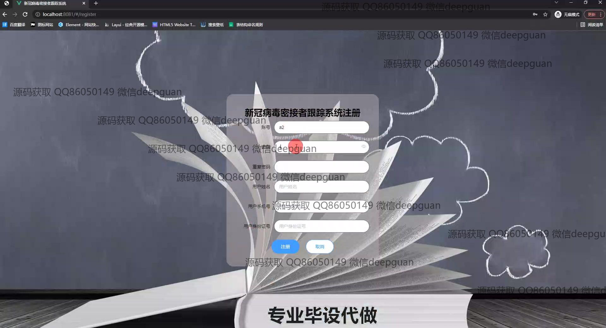

<h1 align="center">新冠病毒密接者跟踪系统</h1>

## 简介
新冠病毒密接者跟踪系统：角色分为管理员、用户；支持个人中心、密接管理、位置管理、疫苗/口罩管理、健康监测、核酸检测及数据查询等功能模块，提升疫情防控管理效率。    --计算机毕业设计源码；毕设源码；java毕业设计源码

## 联系方式

<h3 align="center">获取完整代码与数据库文件 + 微信：deepguan QQ: 86050149 QQ群: 783742310</h3>

<h3 align="center">可帮忙远程部署 包运行成功！提供远程部署、修改代码、设计文档指导、代码讲解等服务！</h3>

## 功能介绍（完整见运行截图）
管理员：登录、注册并管理账户信息；查看和编辑密接者、地点、核酸检测、疫苗和口罩等相关信息模块；进行数据的查询、添加、修改及删除；管理公告信息，支持上传图片及编辑详细说明；通过用户管理界面进行用户信息的录入和调整；管理系统中的疫苗预约和口罩预约申请。

用户：浏览系统提供的各类数据模块，如密接者信息、疫苗类型、核酸检测记录等；可通过用户中心查看和编辑个人信息；进行口罩和疫苗的预约和查看预约状态；跟踪并更新健康状态；通过搜索功能查找公告或信息，支持查看公告详情。

## 运行截图

本代码来源于网络,仅供学习参考使用!

